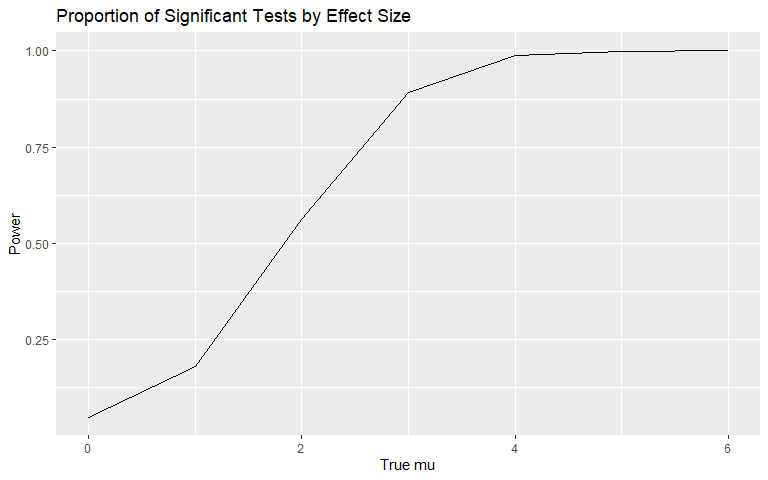
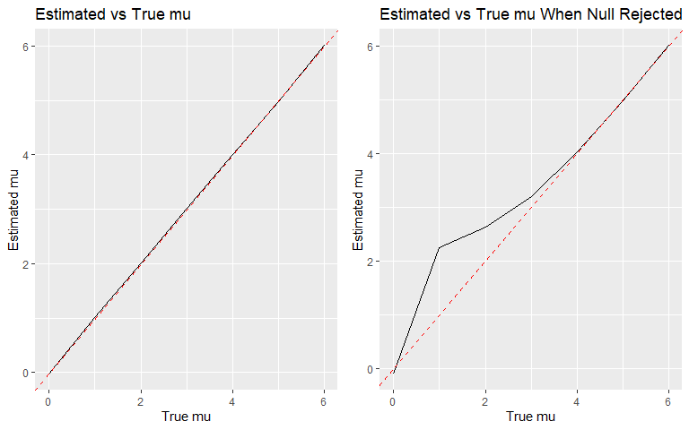
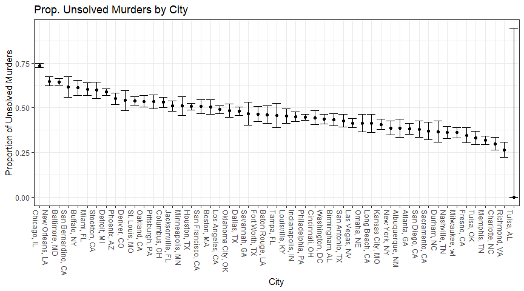

p8105_hw5_ss7332
================
Sean Sorek
2024-11-15

# Problem 2

The instructions for this question are ambiguous. I interpreted the
simulation as testing $H: \mu = 0$ for all possible values of $\mu$.

``` r
sim_normal = function(n, mu, sigma = 5) {
  
  sim_data = tibble(
    x = rnorm(n, mean = mu, sd = sigma),
  )
  
  sim_data |> 
    summarize(
      mu_hat = mean(x),
      p = x |> t.test() |> broom::tidy() |> pull(p.value)
    )
}

sim <- expand_grid(
  n = 30,
  iter = 1:5000,
  mu = 0:6
) |>
  mutate(
    est = map2(n, mu, sim_normal)
) |>
  unnest(est)

sim |>
  group_by(mu) |>
  summarise(power = mean(p <= .05)) |>
  ggplot(aes(x = mu, y = power)) +
  geom_line() +
  labs(x = "True mu", y = "Power",
       title = "Proportion of Significant Tests by Effect Size")
```



As the effect size grows, the power of the test increases dramatically.
It eventually plateaus near 1 for an effect size of four or greater.

``` r
p1 <- sim |>
  group_by(mu) |>
  summarise(estimate = mean(mu_hat)) |>
  ggplot(aes(x = mu, y = estimate)) + geom_line() +
  geom_abline(slope = 1, intercept = 0,
              colour = "red", linetype = "dashed") +
  labs(x = "True mu", y = "Estimated mu",
       title = "Estimated vs True mu")
p2 <- sim |>
  filter(p <= .05) |>
  group_by(mu) |>
  summarise(estimate = mean(mu_hat)) |>
  ggplot(aes(x = mu, y = estimate)) + geom_line() +
  geom_abline(slope = 1, intercept = 0,
              colour = "red", linetype = "dashed") +
  labs(x = "True mu", y = "Estimated mu",
       title = "Estimated vs True mu When Null Rejected")
gridExtra::grid.arrange(p1,p2, ncol = 2)
```



The sample average across tests for which the null was rejected
approximate the true value of $\mu$ for all tested values except when
$\mu = 1$ or 2. For $\mu = 0$, we should not expect a bias for extreme
values of $\hat\mu$ since the sampling distribution is symmetrically
centered at 0. When $\mu > 2$, the estimate approximates the true value
since most tests reject the null. The only values where there are enough
non-rejected tests to induce a visible bias and a true sampling
distribution not centered at 0 are $\mu = 1,2$.

# Problem 3

``` r
homicide <- read_csv("data/homicide-data.csv") |>
  mutate(
    reported_date = lubridate::ymd(reported_date),
    city_state = stringr::str_c(city, state, sep = ", ")
  ) |> glimpse()
```

    Rows: 52,179
    Columns: 13
    $ uid           <chr> "Alb-000001", "Alb-000002", "Alb-000003", "Alb-000004", …
    $ reported_date <date> 2010-05-04, 2010-02-16, 2010-06-01, 2010-01-01, 2010-01…
    $ victim_last   <chr> "GARCIA", "MONTOYA", "SATTERFIELD", "MENDIOLA", "MULA", …
    $ victim_first  <chr> "JUAN", "CAMERON", "VIVIANA", "CARLOS", "VIVIAN", "GERAL…
    $ victim_race   <chr> "Hispanic", "Hispanic", "White", "Hispanic", "White", "W…
    $ victim_age    <chr> "78", "17", "15", "32", "72", "91", "52", "52", "56", "4…
    $ victim_sex    <chr> "Male", "Male", "Female", "Male", "Female", "Female", "M…
    $ city          <chr> "Albuquerque", "Albuquerque", "Albuquerque", "Albuquerqu…
    $ state         <chr> "NM", "NM", "NM", "NM", "NM", "NM", "NM", "NM", "NM", "N…
    $ lat           <dbl> 35.09579, 35.05681, 35.08609, 35.07849, 35.13036, 35.151…
    $ lon           <dbl> -106.5386, -106.7153, -106.6956, -106.5561, -106.5810, -…
    $ disposition   <chr> "Closed without arrest", "Closed by arrest", "Closed wit…
    $ city_state    <chr> "Albuquerque, NM", "Albuquerque, NM", "Albuquerque, NM",…

The `homicide` dataset contains personal and locational data about 52179
homicide victims between 2007-01-01 and 2017-12-31. It describes the
victim’s name, race, age, and sex. It also shows in what city, state,
latitude, and longitude the crime occurred.

``` r
homicide |>
  mutate(
    unsolved = map_lgl(
      disposition,
      \(i) str_detect(i, "Closed without arrest") ||
        str_detect(i, "Open/No arrest")
      )
    ) |>
  group_by(city_state) |>
  summarise(total_murders = n(),
            unsolved_murders = sum(unsolved)) |>
  filter(city_state == "Baltimore, MD") |>
  mutate(
    test_result <- prop.test(unsolved_murders, total_murders) |> broom::tidy()
  ) |>
  select(estimate, conf.low, conf.high)
```

    # A tibble: 1 × 3
      estimate conf.low conf.high
         <dbl>    <dbl>     <dbl>
    1    0.646    0.628     0.663

``` r
homicide |>
  mutate(
    unsolved = map_lgl(
      disposition,
      \(i) str_detect(i, "Closed without arrest") ||
        str_detect(i, "Open/No arrest")
      )
    ) |>
  group_by(city_state) |>
  summarise(total_murders = n(),
            unsolved_murders = sum(unsolved)) |>
  mutate(
    test_result = map2(unsolved_murders, total_murders, \(x, y) prop.test(x, y) |> broom::tidy())
  ) |> unnest(test_result) |>
  select(city_state, total_murders, unsolved_murders, estimate, conf.low, conf.high) |>
  arrange(desc(estimate)) |>
  mutate(
    city_state = as.factor(city_state),
    city_state = fct_reorder(city_state, estimate, .desc = T)
  ) |>
  ggplot(aes(x = city_state, y = estimate)) +
  geom_point() +
  geom_errorbar(aes(ymin = conf.low, ymax = conf.high)) + 
  theme_bw() +
  theme(axis.text.x = element_text(angle = -90, hjust=0)) +
  labs(x = "City", 
       y = "Proportion of Unsolved Murders",
       title = "Prop. Unsolved Murders by City")
```


