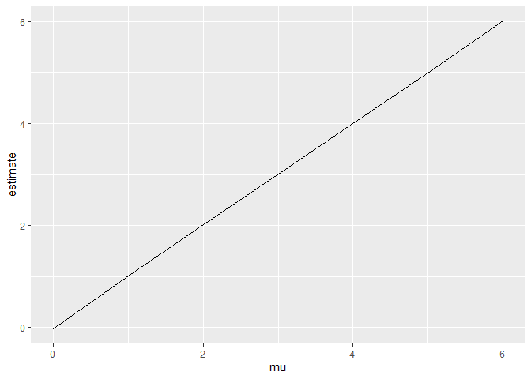
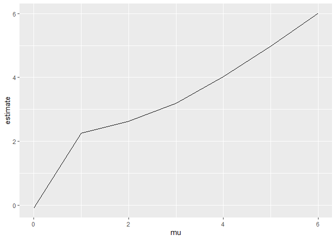

p8105_hw5_ss7332
================
Sean Sorek
2024-11-15

# Problem 2

``` r
sim_normal = function(n, mu, sigma = 5) {
  
  sim_data = tibble(
    x = rnorm(n, mean = mu, sd = sigma),
  )
  
  sim_data |> 
    summarize(
      mu_hat = mean(x),
      p = x |> t.test() |> broom::tidy() |> pull(p.value)
    )
}

sim <- expand_grid(
  n = 30,
  iter = 1:5000,
  mu = 0:6
) |>
  mutate(
    est = map2(n, mu, sim_normal)
) |>
  unnest(est)

sim |>
  group_by(mu) |>
  summarise(power = mean(p <= .05)) |>
  ggplot(aes(x = mu, y = power)) +
  geom_line() +
  labs(x = "True mu", y = "Power",
       title = "Proportion of Significant Tests by Effect Size")
```

<!-- -->

``` r
par(mfrow = c(1,2))
sim |>
  group_by(mu) |>
  summarise(estimate = mean(mu_hat)) |>
  ggplot(aes(x = mu, y = estimate)) + geom_line()
```

<!-- -->

``` r
sim |>
  filter(p <= .05) |>
  group_by(mu) |>
  summarise(estimate = mean(mu_hat)) |>
  ggplot(aes(x = mu, y = estimate)) + geom_line()
```

<!-- -->

# Problem 3
